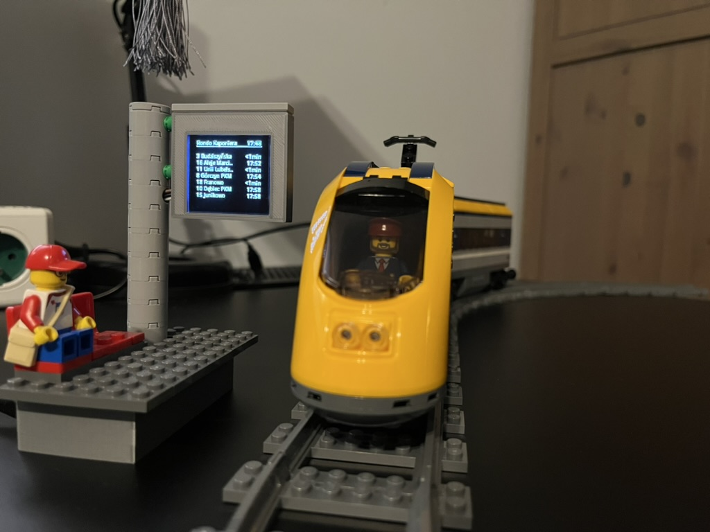

# rpi-display-ztm-virtual-monitor

## About

The repo contains Python script to display ZTM virtual monitor data obtained 
using [ztm_virtual_monitor_python_api](https://github.com/RGoralewski/ztm-virtual-monitor-python-api) 
submodule. Used display is [1.5inch OLED Module by Waveshare](https://www.waveshare.com/wiki/1.5inch_OLED_Module) 
with 16-bit greyscale color. There are also official library files used (inside *waveshare_OLED* directory).

## Requirements

* Python >3.9 (not tested on previous versions)
* RPi.GPIO Python module
* Other Python libraries listed in *requirements.txt* files

## Usage

```commandline
Usage: main.py [OPTIONS]

Options:
  -s, --stop-code TEXT            Stop code in ZTM Poznan  [required]
  -r, --refresh-time INTEGER      Refresh time of the timetable (seconds)
                                  [required]
  -t, --timetable-length INTEGER  A number of rows in result dataframe with
                                  trips  [required]
  -n, --stop-name TEXT            Stop name that will be displayed on the top.
                                  If not given, the stop code will be
                                  displayed.
  -v, --verbose                   Logging level
  -l, --log                       Enable logging to file
  --help                          Show this message and exit.

```

Example:
```commandline
python3.11 main.py -s RKAP71 -r 30 -t 7 -n "Rondo Kaponiera"
```

Stop code can be checked on the [PEKA Virtual Monitor](https://www.peka.poznan.pl/vm/) site.

### LEGO timetable application

 
